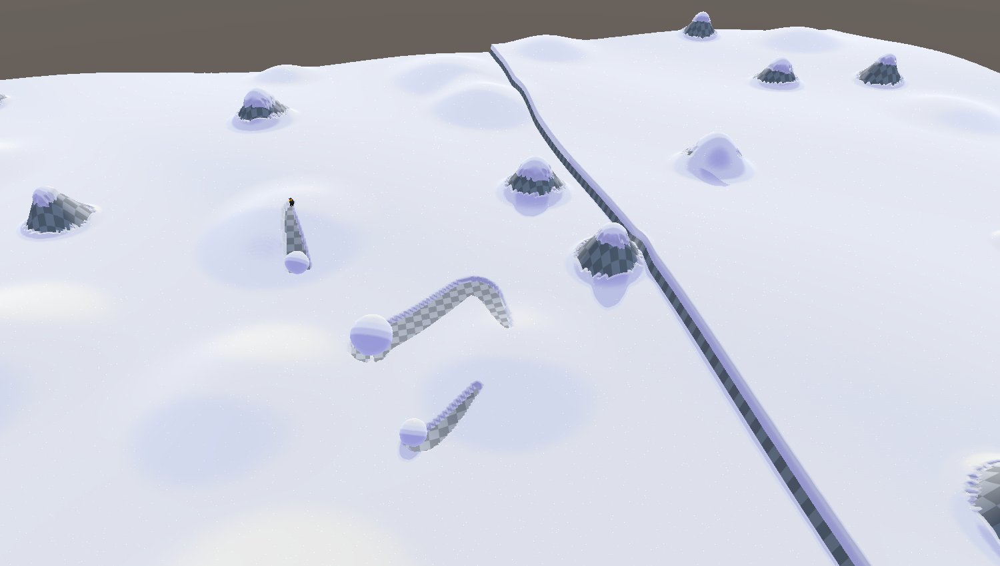
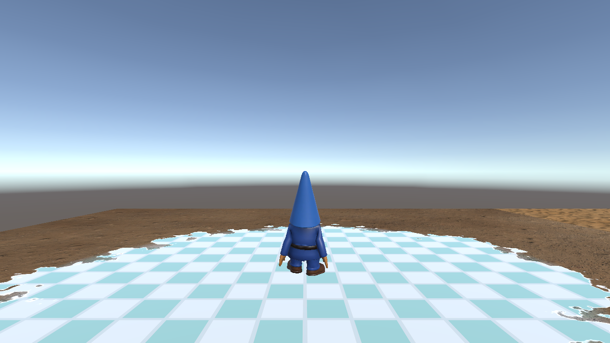
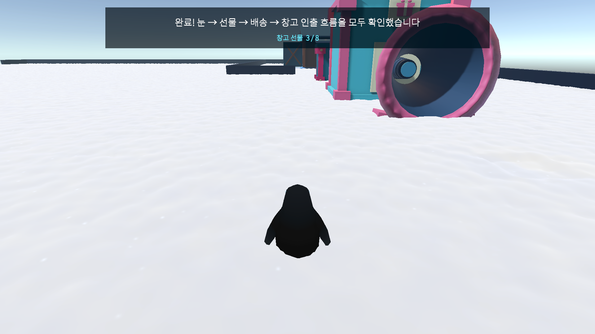
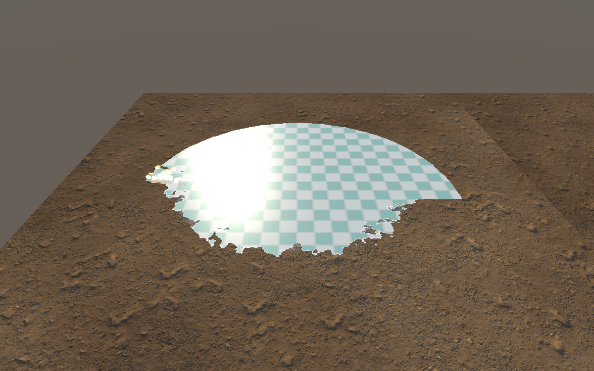

# PPackPPack

눈 덮인 마을에서 펭귄들이 협동해 제설하고 선물을 배송하는 Unity 멀티플레이 게임 프로젝트입니다.

> Portfolio source snapshot · Unity 6000.6 · URP 17.6 · Photon Fusion 2 Host Mode



## Project overview

PPackPPack은 단순한 눈 표현을 넘어, 플레이어 행동이 실제 게임 상태와 지형 표현에 함께 반영되는 협동 플레이를 목표로 합니다. 눈을 밀고 쌓아 길을 만들고, 눈덩이를 굴리거나 운반하며, 열린 경로를 이용해 선물 배송 미션을 수행합니다.

핵심 구현 범위:

- CPU 기반 권위 눈 높이 필드와 GPU 렌더링 표현 분리
- Photon Fusion 2 Host Mode 기반 서버 권위 멀티플레이
- 원인만 복제하고 각 클라이언트가 연출을 재구성하는 네트워크 설계
- 펭귄 이동, 눈덩이 밀기·운반·협동 타이밍 액션
- 배송 주문, 점수, 스테이지 상태, 증강 선택 게임 루프
- Shader/HLSL, VFX Graph, UI Toolkit을 활용한 눈·먼지·청소 연출
- EditMode, PlayMode, 멀티피어 및 헤드리스 스모크 테스트

## Gallery

| Snow simulation | Cleaning interaction |
| --- | --- |
|  |  |
| Gift delivery flow | VFX experiments |
|  |  |

## Technical highlights

### CPU-authoritative snow

눈의 깊이와 판정은 CPU 격자에서 관리하고, 셰이더와 VFX는 그 결과를 표현합니다. 덕분에 렌더 텍스처나 GPU readback을 권위 상태로 사용하지 않으며 멀티플레이와 헤드리스 환경에서 같은 규칙을 유지합니다.

### Network architecture

게임 상태는 소수의 권위 허브에 집중하고 클라이언트는 복제된 상태를 읽어 표현합니다. 도구의 자세와 동작 같은 원인을 동기화하고, 브러시 스탬프나 파티클 같은 효과는 각 피어에서 재생성합니다.

### Feature-oriented Unity structure

코드는 `Core`, `InGame`, `OutGame` 어셈블리로 경계를 나누고, 각 게임 기능이 스크립트·셰이더·VFX·테스트를 함께 소유하도록 구성했습니다. 기능 간 결합과 Unity 씬 충돌을 줄이기 위한 구조입니다.

## Repository map

```text
Assets/Game/
  Core/       shared types and multiplayer session code
  InGame/     snow, penguin, delivery, interaction, UI, VFX
  OutGame/    lobby, matchmaking, menus
  Sandbox/    isolated visual experiments
docs/
  specs/      feature and architecture specifications
  plans/      implementation plans
  Game_Concept.md
  Glossary.md
```

시작점으로 추천하는 영역:

- `Assets/Game/InGame/Snow/HeightCpu/` — CPU 눈 필드와 네트워크 연동
- `Assets/Game/InGame/Penguin/` — 이동, 운반, 눈덩이 상호작용
- `Assets/Game/InGame/Cleanliness/` — 스테이지 상태와 미션 권위 허브
- `Assets/Game/Core/Multiplay/` — 세션과 멀티플레이 부트스트랩
- `docs/specs/` — 구현 의도와 트레이드오프

## Snapshot notice

이 저장소는 포트폴리오 검토를 위한 **소스 스냅샷**입니다. Asset Store 및 기타 제3자 라이선스 에셋, Photon App ID, 대용량 원본 모델·텍스처·오디오는 포함하지 않았습니다. 따라서 저장소만 내려받아 완성된 게임을 실행할 수는 없습니다.

프로젝트 소스의 저작권은 저장소 소유자에게 있으며, 별도 라이선스가 명시되지 않은 한 재사용 또는 재배포 권한을 부여하지 않습니다.
