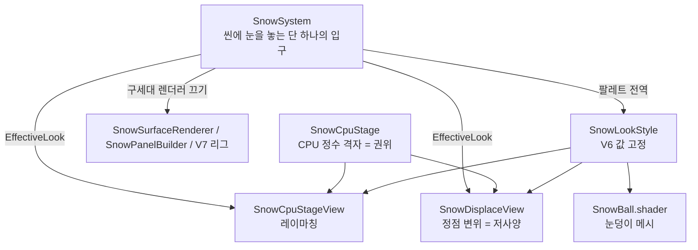

# 눈 렌더링 통합과 저사양 경로

브랜치: `/main` (cs:465 예정) · 날짜: 2026-08-20 · 관련 폴더: `Assets/Game/InGame/Snow/`

이 문서는 **눈을 그리는 경로가 몇 개이고, 무엇이 그것을 정하고, 각 경로가 무엇을 포기하는가**를
정리한다. 값은 전부 실측이고, 측정 기기는 M5 Pro / URP 17.6 / Unity 6000.6.0b7 이다.

---

## 1. 왜 통합이 필요했는가

눈 세대가 셋이었다.

|세대|폴더|무엇|
|---|---|---|
|구세대|`Snow/Scripts/`|`SnowStage` 격자 + 패널/마처. 배송 판정과 싱글플레이가 아직 **데이터**를 읽는다|
|V7 스파이크|`Snow/V7Spike/`|캐주얼 룩을 고정한 스파이크. 리그·블레이드 시각물이 남아 있다|
|현세대|`Snow/HeightCpu/`|CPU 정수 격자가 권위. 지금 게임이 쓰는 것|

씬마다 무엇이 그리는지 손으로 배선돼 있어서 **한 바닥에 눈이 두 벌 그려지는 사고**가 반복됐다.
그것을 `SnowSystem` 하나가 강제하도록 이미 정리했고(cs:434), 이 문서의 작업은 그 위에
**경로 선택**과 **저사양 경로**를 얹은 것이다.

---

## 2. 지금의 구조



**권위는 언제나 `SnowCpuStage`** 이고 렌더 경로는 그것을 읽기만 한다. 팔레트는 `SnowSystem` 이
전역으로 밀고 **세 소비자**(마처·저사양·눈덩이)가 같은 값을 읽는다 — 그래야 옵션을 바꾼 것이
조명을 바꾼 것처럼 보이지 않는다.

### `ESnowLook`

|값|무엇|대상|
|---|---|---|
|`Raymarch`|프록시 박스 하나에 픽셀마다 광선. `SV_Depth` 로 실루엣·교차를 깊이에서 얻는다|데스크톱|
|`Displace`|미리 쪼갠 패널의 정점을 높이 텍스처로 밀어올린다|모바일·저사양|
|`Hidden`|안 그린다|데디 서버, 성능 A/B|

`Look` 은 **요청**이고 `EffectiveLook` 이 **결과**다. HUD·검증은 후자를 읽어야 한다.

---

## 3. 무엇이 경로를 정하는가 — 품질이 아니라 **능력**

```
graphicsDeviceType == Null            -> Hidden   (데디 서버·헤드리스)
Raymarch 요청 && graphicsShaderLevel < 45 -> Displace
그 외                                  -> 요청 그대로
```

**품질 설정으로 가르지 않는다.** 마처는 `#pragma target 4.5` 에 프래그먼트가 `SV_Depth` 를 쓰므로
GLES3(레벨 35)에서는 **컴파일 자체가 안 된다** — "느리다" 가 아니라 "안 된다" 다. 품질로 가르면
두 방향으로 다 틀린다: 저사양 PC 가 멀쩡히 돌아가는 마처를 못 쓰고, 고품질로 맞춘 모바일이 검은
화면을 본다.

`_autoDowngrade` 를 끄면 요청이 그대로 적용된다(개발용 강제 — 이 문서의 비교 스크린샷을 그렇게 찍었다).

---

## 4. 저사양 경로가 하는 일과 포기하는 것

`SnowDisplaceView` + `Shaders/SnowDisplace.shader`.

**하는 일**: 필드를 덮는 평면 격자를 만들고, 정점 셰이더가 높이 텍스처를 한 번 탭해서 Y 를
밀어올린다. 노멀도 정점에서 유한차분 두 번으로 만든다.

**안 하는 일 셋** — 이것이 "저사양" 의 내용이다.

1. **마칭 안 함.** 픽셀당 광선이 없다.
2. **`SV_Depth` 안 씀.** `target 3.5` 로 컴파일된다.
3. **구운 텍스처 안 읽음.** 로브·둥근 어깨·coarse-max 를 굽지 않는다. 그 굽기는 **마처를 먹이려고만
   존재**하므로 같이 사라진다(844,800 셀에서 1.79 ms 였다).

**포기하는 것 셋** — 정직하게.

1. **실루엣이 정점 간격까지만 선명하다.** 기본 0.5 m 다. 마처는 셀(12.5 cm)까지 선명하다.
   간격을 좁히면 정점이 제곱으로 늘어난다(40x40 m 에서 0.5 m = 6,561 정점 / 12,800 삼각형,
   12.5 cm 로 좁히면 10 만 정점을 넘는다).
2. **차량·공과의 교차가 픽셀 단위가 아니다.** 마처는 깊이로 공짜로 얻는 것을 여기서는 지오메트리
   정확도만큼만 얻는다.
3. **둥근 어깨(fillet)와 구운 로브가 없다.** 대신 정점 값노이즈로 3 cm 만 흔들어 각진 슬래브로
   보이지 않게 한다.

### 실측 비용 (40x40 m 필드, 눈 60 cm, 자국 있는 상태)

|경로|프레임 평균|최악|
|---|---|---|
|`Raymarch`|**1.63 ms**|8.30 ms|
|`Displace`|**1.04 ms**|239.59 ms|
|`Hidden`|1.02 ms|8.44 ms|

- 저사양은 **기준선(Hidden 1.02 ms)과 사실상 같다** — 즉 이 필드 크기에서 눈을 그리는 비용이
  거의 0 이다. 마처는 +0.61 ms.
- **최악 239 ms 는 전환 순간의 1 회 히치**다(격자 메시 생성 + 셰이더 컴파일). 런타임에 옵션을
  바꾸면 사람이 느낀다. **로드 시점에 정하는 것을 전제로 한다.**
- 데스크톱에서 0.6 ms 차이는 작다. 이 경로의 값은 성능이 아니라 **모바일에서 아예 되는 것**이다.

증거: `docs/images/verify/snow_look_raymarch.png` / `snow_look_displace.png` (같은 씬·같은 카메라·
같은 자국).

---

## 5. 만들면서 걸린 결함 둘

### 인라인 샘플러 이름은 규약이다

`SAMPLER(sampler_linear_clamp_SnowDisplace)` 로 접미사를 붙였더니 유니티가 인라인 샘플러로
알아보지 못하고, 높이 탭이 **초기값에 고정**됐다. 증상은 "눈은 하얗게 그려지는데 자국이 화면에
안 나온다" 였다 — 알베도는 깊이 60 cm 로 계산되고 있었으므로 텍스처를 읽는 것처럼 보였다.
이름을 마처와 같은 `sampler_linear_clamp` 로 되돌리자 자국이 나왔다.

### 정점 변위 경로는 바운즈를 손으로 줘야 한다

정점이 CPU 에서 움직이지 않으므로 유니티가 계산한 바운즈는 **두께 0 인 판**이다. 그대로 두면
카메라가 눈 위를 볼 때 컬링이 판 전체를 잘라 눈이 통째로 사라진다. 높이 여유를 16 m 로 줬다.

---

## 6. 구세대·V7 삭제 — 아직 못 한다

이번에 **한 걸음만** 옮겼다: `ISnowBladeState` 를 `V7Spike/Scripts/` 에서 `HeightCpu/` 로 옮기고
네임스페이스를 `SnowSpike.PileV7` → `PPack` 으로 바꿨다(평평한 이름공간 규칙). 현세대
`SnowCpuStage` 가 스파이크 폴더의 파일에 의존하던 고리가 그것 하나였다.

**남은 차단 요인**(전부 실측 확인):

|무엇|누가 참조|
|---|---|
|`SnowV7MapRig`|`MultiplayPlowVehicle` 이 직접 참조 (`using SnowSpike.PileV7`)|
|`PF_SnowV7Rig`|`MP_Gameplay` 씬 인스턴스 (`m_IsActive: 0` 이지만 참조)|
|`PF_SnowV7Blade` · `M_SnowBlade`|`PF_MultiplayPlow` 프리팹|
|구세대 `SnowStage` 격자|`Delivery` 4 곳(테스트 2 포함) · `Cleanliness` 2 곳|

**삭제 순서는 이렇게 된다**: (1) `MultiplayPlowVehicle` 에서 V7 리그 의존을 끊고 블레이드 시각물을
현세대로 옮긴다 → (2) `MP_Gameplay`·`PF_MultiplayPlow` 재배선 → (3) `Delivery`·`Cleanliness` 를
`SnowCpuStage` 로 이관 → (4) 그때 폴더 둘을 지운다. 각각 자기 검증이 필요하므로 별건이다.

---

## 7. 배선 상태

`SnowDisplaceView` 를 눈이 있는 씬 **6 곳 전부**에 붙였다(꺼진 상태로 — 켜는 것은 `SnowSystem`).
컴포넌트가 없으면 자동 낮춤이 갈 곳이 없어 `Hidden` 으로 떨어지므로, **붙여 두는 것 자체가
안전망**이다.

- `Snow/Tests/Snow_BallPush_Test`
- `Multiplay/Scenes/MP_Gameplay`
- `Cleanliness/Scenes/SinglePlay`
- `Map/WinterVillage/Scenes/WinterVillage_ConceptMap`
- `Map/WinterVillage/Scenes/WinterVillage_HillsideMap`
- `Map/Neighborhood/Scenes/Neighborhood_ConceptMap`

---

## 8. 아직 안 한 것

- **실제 모바일 기기에서 안 돌려봤다.** 자동 낮춤 분기는 `graphicsShaderLevel < 45` 비교 하나이고
  이 기기는 50 이라 그 분기를 타지 않는다. 저사양 경로 자체는 강제로 켜서 검증했다.
- **저사양 경로에 눈덩이 그림자·교차 검증이 없다.** 눈덩이는 별도 메시라 두 경로에서 같게 보이지만,
  눈에 파묻히는 표현은 마처에서만 픽셀 단위다.
- **relax CPU 비용은 그대로다.** 저사양이 없앤 것은 굽기(1.79 ms)이고 relax(2.14 ms)는 남는다 -
  그것은 렌더가 아니라 시뮬이므로 반복·창 크기로 따로 조절해야 한다.
