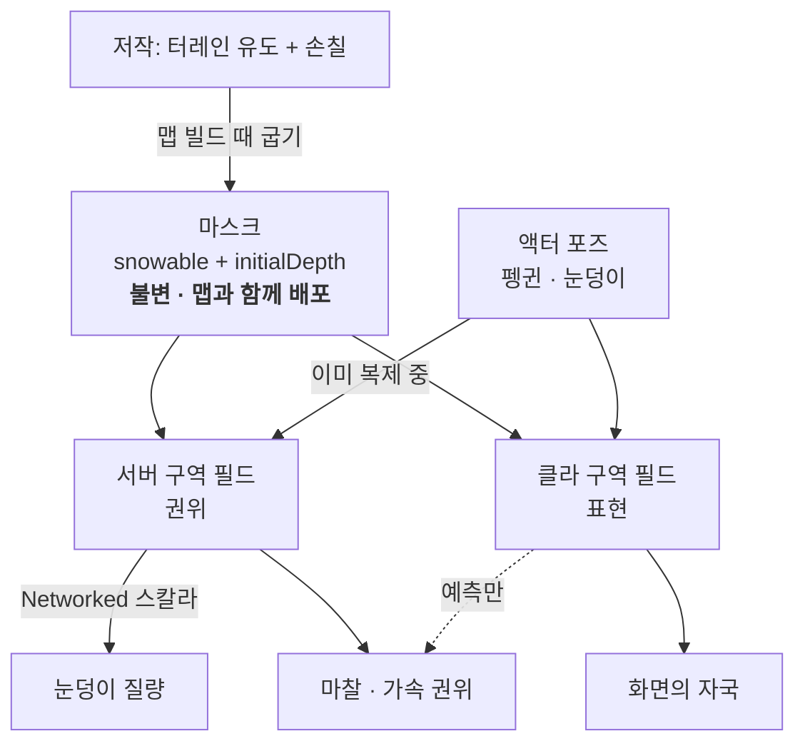

# 눈 구역화 — 전제 변경과 그 파급

브랜치: 미정 (설계 단계) · 날짜: 2026-08-23 · 관련 폴더: `Assets/Game/InGame/Snow/`

이 문서는 **눈이 더 이상 점수가 아니게 되면서 무엇이 무너지고 무엇이 가능해지는가**를 정리한다.
레퍼런스는 Lonely Mountains: Snow Riders 이고, 그 분해는
`docs/html/2026-08-22-snow-riders-teardown/index.html` 에 있다 — 단 **그 문서의 §04·§05·§07 은
이 문서가 뒤집는 낡은 전제 위에 서 있다.**

---

## 1. 무엇이 바뀌었나

**눈을 치우는 것 자체가 메인 점수가 아니다.** 눈이 하는 일은 셋뿐이다.

1. 눈덩이 크기를 키운다
2. 환경(분위기)
3. 슬라이딩 마찰·가속

따라서 **지워진 영역 자체를 동기화할 필요가 없다.** 서버가 상태를 들고 계산하되, 클라이언트는
캐릭터·눈덩이 기준으로 눈이 깎이는 모습이 **보이기만** 하면 된다.

### 눈은 재생 자원이다 — 단, 국소이고 수동이다 (2026-08-23 확정)

눈을 **공급하는 쪽이 있다.** 다만 성질이 중요하다.

- 재생은 **맵 전체가 아니라 정해진 재생 구역**에서만 일어난다
- 그 구역조차 **누가 작동시켜야** 재생된다. 저절로 차오르지 않는다
- 그리고 **눈덩이는 잔설을 남기지 않고 0 까지 지운다**
  (`SnowBallCarrier.cs:61` `_residueMm = 250` → **0**)

결과 셋. 앞의 둘은 단순해지고, 셋째는 **반대로 조건이 붙는다.**

1. **"처녀설" 이라는 개념이 없다.** 추적할 것은 이진 지도가 아니라 현재 깊이 하나뿐이다.
2. **"한 번 먹은 땅은 끝" 도 아니다.** 단 재생 구역 안에서, 누군가 작동시켰을 때만.
3. ⚠️ **어긋남은 저절로 낫지 않는다.** 재생이 전역·상시였다면 모든 셀이 상한으로 수렴해서
   서버·클라 불일치에 반감기가 생겼을 것이다. **국소·수동이면 그렇지 않다** — 맵의 대부분은
   세션 내내 단조 감소하고, 한 번 벌어진 차이는 그 자리에 남는다. 따라서 §6 의 **접속 스냅샷은
   여전히 필요**하고, 마찰 양자화도 여전히 필요하다.

**맵은 고갈되는 자원이고 재생 구역은 보급소다.** 이건 성능 결정이 아니라 게임 페이싱 결정이다 —
누군가 보급소를 돌리는 동안 다른 사람이 굴리는 협동 압력이 여기서 나온다.

### 재생 발동은 원인이라 거의 공짜다

"플레이어가 틱 T 에 X 의 재생기를 켰다" 는 몇 바이트다. 각 피어가 그걸 받아 **같은 코드로 같은
증착을 자기 격자에 돌린다.** 눈덩이와 같은 패턴이고 추가 대역폭은 사실상 0 이다.

대신 **결정성이 전제조건**이 된다. 이건 새 요구가 아니라 이미 세워진 것이다 —
`SnowHeightFieldCpu` 의 클래스 주석이 정수 격자를 고른 첫째 이유로 *"피어 간 비트단위 동일성.
데디서버가 원인만 복제하고 각 피어가 필드를 재생성하는 구조에서는 이게 전제조건이다"* 를 든다.
재생을 원인으로 복제하는 순간 그 전제가 실제로 쓰인다.

### 이 한 줄이 무너뜨리는 것

`SnowCpuStage.cs:903~962` 의 셀 델타 스트리밍(셀당 6 B × `MaxCellsPerPlayerTick` 256 / 틱 / 인)은
**튜닝 대상이 아니라 존재 이유가 사라진 코드**다. 4인 전달률 2.4% 는 고칠 문제가 아니라 안 겪을
문제가 됐다.

teardown 이 "옮기면 안 되는 것" 1순위로 못박은 문장 — *"그들의 권위 눈은 불변이고 우리 건
점수다"* — 이 절반만 남는다. **경계는 불변, 깊이만 가변.**

---

## 2. 구조 — 구역(Region)

**구역은 각자 원점과 바닥면을 가진 독립 필드다.** 월드 XZ 격자 하나를 타일로 쪼갠 것이 아니다.
이 정의가 결정적인 이유는 §4·§5 에 있다 — 나중에 바꾸면 인덱싱을 다시 짜야 하므로 **지금 정한다.**

| 정의 | 지붕 · 램프 | 큰 월드 |
|---|---|---|
| 월드 XZ 격자를 타일로 쪼갬 | ❌ XZ 가 겹치면 인덱스 충돌, 영구 불가 | ❌ dense 배열이 면적에 비례 |
| **각자 원점·바닥면을 가진 독립 필드** | ✅ | ✅ 구역 밖은 셀이 없음 |

### 왜 큰 월드에서 지금 구조가 죽는가

`SnowHeightFieldCpu.cs:125` 는 `new ushort[geo.CellCount]` — **맵 전체가 한 배열**이다.
`SnowFieldGeometry.CellSizeM` 0.125 m 기준:

| 맵 | 셀 | 높이 배열 |
|---|---|---|
| 40 m | 320² | 200 KB |
| 128 m | 1,024² | 2 MB |
| 512 m | 4,096² | 32 MB |
| 1 km | 8,192² | 128 MB |
| 2 km | 16,384² | **512 MB** |

렌더용 높이 텍스처가 같이 커지므로 실제 벽은 이보다 먼저 온다. **dense 배열의 한계는 대략
512 m.** 구역화하면 눈 구역 총면적에만 비례하고 **월드 크기와 무관해진다.**

`SnowChunkQuadtree` 는 이미 있으나 **dense 위에 얹혀 있다** — 하는 일은 dirty 청크를 전수 스캔
없이 모으는 것이지 희소 할당이 아니다. 그 클래스 주석이 이미 "512 m 로 키우면 65,536개" 를
상정하고 쓰여 있다. 방향은 맞고, 배열이 dense 인 것이 남은 부분이다.

---

## 3. 저작 — 생성기와 덮어쓰기, 그리고 굽기

터레인 유도와 손칠은 **두 방식이 아니라 하나의 데이터에 대한 두 저작 경로**다.

- **터레인 유도** = 생성기
- **손칠** = 덮어쓰기
- **맵 빌드 시점에 하나의 마스크로 굽는다.** 런타임은 어느 쪽에서 왔는지 몰라야 한다.

셀당 두 값이면 충분하다.

| 값 | 뜻 |
|---|---|
| `snowable` | 여기 눈이 있을 수 있나. 꺼져 있으면 **셀 자체가 없다**(희소) |
| `initialDepthMm` | 처음 얼마나 쌓여 있나 |

이것이 80.lv 가 기록한 Downhill 워크플로우와 같다 — *"지면 타입을 터레인에 직접 칠하고 스플랫맵
2장에 저장하며, 그 타입이 색뿐 아니라 딸린 물리·오디오 속성까지 전부 정의한다."*

**구운 결과는 런타임에 안 변하므로 보낼 것이 없다.** 서버와 모든 클라가 맵과 함께 로드 시점에
갖는다. "특정 구간에만 눈이 있다" 는 별도 기능이 아니라 **마스크가 꺼진 구간**이다.

### 기각 — 셰이더 마스크만으로 눈을 표현하는 안

"눈 가능한 메쉬를 머티리얼로 지정하고 마스크를 지운다" 는 **두께가 없어서** 성립하지 않는다.
눈덩이는 부피를 먹어 커지고 마찰은 깊이를 읽는데 마스크는 2D 다. 두께를 텍셀당 스칼라로
흉내내도 루트 `AGENTS.md` 의 **"RenderTexture 는 권위를 못 든다"** 에 걸려 서버용 CPU 사본이
필요해지고, 그것이 이미 있는 높이 필드다. 한 바퀴 돌아 제자리다.

---

## 4. 상호작용 눈과 장식 눈 — 기준은 "올라가느냐"

높이 필드는 **XZ 당 한 층**이다. 한 구역이 지붕 위 눈과 그 아래 땅의 눈을 동시에 들 수 없다.
그러나 §2 의 정의(구역은 독립 필드)를 쓰면 **지붕이 자기 구역을 가지면 된다.**

| | 표현 | 지울 수 있나 | 성장·마찰에 관여 |
|---|---|---|---|
| **상호작용 눈** | 자기 원점·바닥면을 가진 구역 필드. 지면이든 **올라갈 수 있는 지붕**이든 동일 | ✅ | ✅ |
| **장식 눈** | 메시·머티리얼. 못 올라가는 지붕·처마·난간·나뭇가지 | ❌ | ❌ |

**기준은 "지면이냐 지붕이냐" 가 아니라 "플레이어가 올라가느냐" 다.** 저작할 때 헷갈리지 않고,
성능 예산과도 그대로 맞는다 — 구역마다 고정 오버헤드(쿼드트리 · coarse max · 렌더 메시 ·
업로드 텍스처)가 있으므로 구역 수는 저작이 통제해야 하는 값이다.

이 선을 문서에 박아두지 않으면 "왜 저 지붕 눈은 안 파여요" 가 버그 리포트로 올라온다.

### 조회 해소

"이 액터가 선 곳은 어느 구역인가" 는 새로 만들 것이 없다 —
`SnowBallCarrier.cs:540` 에 이미 아래로 쏘는 `Physics.RaycastAll` 이 있고 거기 붙인다.

### 안 되는 것

- **오버행 · 돔.** 아래로 말린 처마나 둥근 지붕은 높이 필드로 표현되지 않는다. 경사 지붕은 된다.
- **수직 벽.**
- **구역을 벗어난 눈이 아래로 떨어지는 것.** 지붕 눈사태는 별개 기능이다. 현 규칙은 **안 떨어진다** —
  구역을 벗어난 눈은 사라진다. (눈덩이 자체는 리지드바디라 알아서 굴러떨어진다.)

---

## 5. 경사

경사는 §2 의 구역 정의가 그대로 답이다. 갈래가 둘이고 성질이 다르다.

**(A) 완만한 지형 경사** — 지면 구역에 두고 깊이를 **월드 Y 방향**으로 잰다. 셀은 XZ 격자에
남고, 대가는 셀이 표면에서 늘어나는 것이다.

| 경사 | 셀 실제 폭 (0.125 m 기준) | 체감 |
|---|---|---|
| 15° | 0.129 m | 없음 |
| 30° | 0.144 m | 없음 |
| 45° | 0.177 m | 가장자리가 살짝 뭉툭 |
| 60° | 0.250 m | 눈에 띔 |
| 75° | 0.483 m | 망가짐 |

**(B) 가파른 램프 · 경사 지붕** — 자기 구역으로 떼고 **바닥면 법선 기준**으로 깊이를 잰다.
격자가 표면에 붙으므로 **늘어남이 0** 이다. 45° 램프가 평지와 같은 해상도를 받는다.

**규칙: 대략 45° 까지는 지면 구역, 그 위는 자기 구역.** 이 판단은 §4 의 "따로 구역으로 뗄까" 와
같은 판단이라 새 노브가 아니다.

### 경사가 게임적으로 가장 좋은 부분이다

눈 깊이가 슬라이딩 가속에 걸리므로 **경사에서 이미 파인 자국이 빠른 라인이 된다** — 깊은 눈은
느리고 다져진 골은 빠르다. Snow Riders 리뷰가 관찰한 *"이전 시도의 스키 자국이 다음 시도의
길잡이가 된다"* 가 우리 쪽에서는 **공짜로 나온다.** 평지에서는 잘 안 느껴지고 경사에서는 가속이
거리에 적분되어 벌어진다.

### 함정 — 기울어진 구역에서 중력

구역 바닥을 기울이면 격자의 "위" 가 월드의 "위" 가 아니다. 이완(relax)을 구역 축 기준으로
돌리면 **45° 램프 위에 눈이 중력을 무시하고 평평하게 앉는다.**

**기울어진 구역에서는 이완을 돌리지 않는다.** 램프 위 눈은 저작된 것이고 깎이기만 하면 되지
안식각으로 흘러내릴 필요가 없다. 서버는 어차피 이완을 돌리지 않으므로(실측 3.25 ms/스텝) 끄는
비용도 없다.

수평 바닥 구역은 반대로 이완이 필요하고, 거기서는 **깊이가 아니라 절대 표면 높이(바닥 + 깊이)로
계산해야 한다.** 지금은 바닥이 상수 0 이라 이 버그가 존재할 수 없었다 —
`SnowRaymarchRendererCpu.cs:144` 가 `_GroundY` 에 `0f` 를 박고 있고 `SnowFieldGeometry` 에는
**Y 축이 아예 없다**(`OriginXM`, `OriginZM` 뿐). 바닥이 터레인이 되는 순간 이것이 주 경로가 된다.

---

## 6. 네트워크 — 무엇을 보내고 무엇을 안 보내나

**불변식: 클라 격자를 읽고 정해지는 게임 값이 하나도 없어야 한다.** 클라 격자는 표현용이고
서버 격자와 어긋나도 되지만, 어긋남이 게임 값으로 새면 안 된다.

| 값 | 주인 | 클라가 얻는 법 | 현 상태 |
|---|---|---|---|
| 눈덩이 질량 · 반지름 | 서버 스칼라 | `[Networked]` 직접 복제 | ✅ 이미 맞음 |
| 구역 마스크 · 초기 깊이 | 저작 데이터 | 맵과 함께 로드 | 없음 (신규) |
| 눈 깊이 격자 | 서버 권위 | 각 피어가 **복제된 액터 포즈로 재유도** | ❌ 지금은 셀 델타 전송 |
| 화면의 자국 | 클라 전용 | 자기 격자에서 | ✅ |
| 마찰 · 가속 | 서버 권위 + 클라 예측 | 클라가 자기 격자를 읽음 | ⚠️ **유일한 누수 경로** |

눈덩이 질량이 이미 안전한 근거: `SnowBallCarrier.cs:86` `[Networked] NetMassMm`, 쓰기는
`HasStateAuthority` 게이트(`:234`), 클라는 읽기 전용(`:599`), 반지름은 질량에서 유도(`:145`).

액터 포즈는 **어차피 렌더링 때문에 복제 중**이므로 격자 재유도의 추가 대역폭은 0 이고, 팀원
자국도 자동으로 보인다. teardown §04 가 계산한 명령 복제 5.8 KB/s 대 셀 델타 요구 2.5 MB/s
(약 434배) 가 이 선택의 크기다.

### 중간 접속 · 재접속 — 1회 스냅샷이 필요하다

늦게 들어온 클라의 격자는 초기 깊이 그대로이고 **저절로 수렴하지 않는다** — 재생이 국소·수동이라
(§1) 맵의 대부분은 한 번 깎이면 그대로다. 접속 시 1회 스냅샷이 필수다.

비용은 걸림돌이 아니다: 40×40 m · 12.5 cm 면 320×320 = 102,400 셀, `ushort` 그대로 200 KB,
1 m 다운샘플이면 1,600 B. **틱당이 아니라 1회다.**

재생이 전역·상시였다면 이 절이 통째로 필요 없었다 — 모든 셀이 상한으로 수렴하면서 불일치를
씻어냈을 것이다. 그 설계를 고르지 않았으므로 스냅샷은 선택이 아니다.

### 마찰은 양자화한다

깊이에 연속적으로 반응하면 격자 어긋남이 그대로 손에 느껴진다. **처녀설 / 다진눈 / 맨바닥**
3단계로 양자화하면 어긋나도 같은 단계로 떨어질 확률이 높다. 경사가 있으면 가속이 거리에
적분되므로 이 완충이 평지보다 더 필요하다.

---

## 7. 룩 — 지금 화면이 Snow Riders 와 다른 이유

`docs/html/2026-08-22-snow-look-compare/` 의 우리 화면과 Steam 공식 스크린샷 8장을 나란히 본
결과. **대부분이 높이 필드가 아니라 셰이딩·저작 문제다.**

| 요소 | Snow Riders | 우리 |
|---|---|---|
| 캐스트 그림자 | 길고 부드럽고 청보라. **형태의 주된 단서** | **없음** |
| 매크로 형태 | 둔덕 · 능선 · 바위를 덮는 두꺼운 입술 | 완전 평면 |
| 미세 그레인 | 조밀한 반짝임이 전면에 | 없음 |
| 자국 | 표면 마크, **실루엣 불변** | 12.5 cm 격자 계단 |
| 눈보라 VFX | **메시** 덩어리 (빌보드 0개 — 인터뷰 명시) | — |

**그들의 스키 자국은 변위가 아니다.** 스크린샷 8장 전부에서 자국이 실루엣을 바꾸지 않는다.
우리가 Raymarch 로 푸는 문제(가장자리 fillet · 픽셀 단위 교차)를 **그들은 풀지 않는다.**

### 지금 당장 틀려 있는 것

1. **`SnowDisplace.shader:166` — `shadow` 인자에 `1.0` 이 박혀 있다.** ShadowCaster 패스는 있어
   눈이 그림자를 던지지만 **받지 않는다.** `_MAIN_LIGHT_SHADOWS` multi_compile 이 없다.
2. **Raymarch 도 같다.** `SnowRaymarchCpu.shader:87` 의 `SunShadow()` 는 높이 필드를 다시 마칭하는
   **셀프섀도우**이고 URP 섀도맵을 읽지 않는다. 나무가 눈에 그림자를 못 떨어뜨린다.
3. **스파클이 레퍼런스와 반대 방향으로 설계돼 있다.** `SnowCasualStyle.hlsl` 이 명시적으로
   *"neither can turn into a glitter field"* 라고 못박고 20 cm 셀의 크고 성긴 반짝임을 골랐다.
   Snow Riders 는 정확히 글리터 필드다. **버그가 아니라 의도적으로 갈린 선택**이므로, 뒤집으려면
   그 근거(예전에 젖은 플라스틱으로 보였다)를 다시 봐야 한다.

**매크로 형태(2번)는 눈 시스템이 아니라 맵 저작 문제다.** 바닥이 터레인이 되면(§5) 자동으로
따라온다. 1번은 한 줄에 가깝고 가장 싸다.

### ⚠️ 잔설 0 이 미검증 아티팩트를 깨운다

`docs/html/2026-08-22-snow-look-compare/` 가 마지막 절에 경고를 남겨 뒀다. 비교용 자국을 필드
높이에 **직접 0 을 써서** 만들었더니 Raymarch 도랑 안쪽에 **얼룩말 무늬 아티팩트**가 나왔고,
거기 이렇게 적혀 있다 —

> 실제 게임은 눈덩이가 지나가도 잔설 250 mm 를 남기므로, 높이가 정확히 0 인 넓은 면은 잘
> 생기지 않는다. 실제 플레이에서도 나오는지는 **확인하지 않았다** — 눈을 0 까지 미는 도구가
> 있다면 따로 봐야 한다.

**§1 이 잔설을 0 으로 정했으므로 그 "따로 봐야 한다" 가 지금 발동했다.** 높이 0 인 넓은 면이
이제 정상 플레이에서 상시로 생긴다. `_residueMm` 를 0 으로 내리는 변경과 **같은 세션에서**
Raymarch 경로를 눈으로 확인할 것. 이건 예상되는 회귀이지 놀랄 일이 아니다.

---

## 8. 미정

채택 전에 정해야 하는 것 셋 — (b) (c) (d). (a) 는 2026-08-23 에 답이 나왔고 기록만 남긴다.

### (a) 눈은 소모되는가 — **답 나옴 (2026-08-23), §1 참조**

소모되고, 잔설 없이 0 까지 지워지고, **국소 재생 구역에서 수동 발동으로만** 다시 찬다.
성장은 **눈이 있는 셀에서만** 일어난다 — 깊이 0 인 셀 위를 굴러도 공은 커지지 않는다.

이 답이 남긴 새 미정이 (c) 다.

### (c) 재생 구역 설계

개수 · 발동 방식(스위치? 지속 조작? 자원 소모?) · 재생 속도. **이건 성능이 아니라 페이싱을
정한다** — 재생 속도가 "한 자리에서 파밍할 수 있는가" 를 그대로 결정하고, 그것이 플레이어를
맵으로 내보낼지 말지를 정한다. 느리면 돌아다녀야 하고, 빠르면 보급소에 눌러앉는다.

### (b) 터레인 유도 규칙

경사? 고도? 실내 여부? 유도 결과를 손칠이 덮어쓰므로(§3) 유도가 완벽할 필요는 없고 **대부분을
맞히면 된다.** 규칙이 정해지면 굽는 도구의 입력이 확정된다.

### (d) 높이 양자가 지금처럼 잘아야 하는가

현재는 `ushort` 밀리미터 — 1 mm 단계, 천장 65.535 m. 세분화가 과해 보인다는 지적이 있었다.

**먼저 정정할 것: 이 세분화는 그림을 위한 것이 아니다.** `SnowHeightFieldCpu` 클래스 주석이 이유
셋을 명시한다.

1. **정수여야 하는 이유 ①** — 피어 간 비트단위 동일성. 정수 연산은 플랫폼·컴파일러·SIMD 재배열과
   무관하게 같은 답을 낸다. **원인만 복제하고 각 피어가 필드를 재생성하는 구조의 전제조건**이다.
2. **정수여야 하는 이유 ②** — 질량 보존이 근사가 아니라 항등식이 된다. float 이면 "엡실론 이하여야
   함" 이 되어 진짜 누수와 드리프트를 구별할 수 없다. v7 의 누수는 컷 텍셀당 +0.05 고정단위 ·
   초당 46 mL 였고 **3분을 돌린 뒤에야** 계측기에 잡혔다.
3. **`ushort` 인 이유** — `ushort[]` 가 R16 UNorm 텍스처와 **같은 바이트**라 업로드가 `memcpy` 다.
   `int32` 면 매 프레임 변환 패스가 하나 붙는다.

그런데 **1과 3은 `byte` 도 만족한다** — `byte` 역시 정수이고 R8 UNorm 과 같은 바이트다. 셰이더도
안 바뀐다: 폴더 `AGENTS.md` 가 *"셰이더는 깊이 단계 수를 모른다 — `depth01 * _SnowMaxDepth` 뿐"*
이라고 못박아 뒀다.

**그러므로 진짜 제약은 정밀도가 아니라 최대 깊이다.**

| 타입 | 양자 | 천장 | 셀당 1양자 부피 (12.5 cm 셀) | 격자 메모리 (512 m) |
|---|---|---|---|---|
| `ushort` (현재) | 1 mm | 65.5 m | 15.6 mL | 32 MB |
| `byte` | 1 cm | **2.55 m** | 0.156 L | **16 MB** |
| `byte` | 2 cm | 5.1 m | 0.313 L | 16 MB |

클래스 주석은 *"눈 최고 4 m 남짓"* 을 상정하고 `ushort` 를 골랐다. 그 4 m 는 **제설차가 눈을
더미로 밀던 시절의 값**이다. 지금 게임에 그런 더미가 없다면 `byte` + 1 cm 가 성립하고 격자
메모리가 절반이 된다.

**질문이 "정밀도가 필요한가" 가 아니라 "눈이 여전히 4 m 까지 쌓이는가" 로 바뀐다.**

**권장: 지금은 건드리지 않는다.** 40 m 맵에서 200 KB 라 병목이 아니고, 4 m 가정을 먼저 확인해야
하고, 보존 원장이 10배 거칠어지는 것(15.6 mL → 0.156 L)이 §1 의 성장 계산에 어떻게 걸리는지도
안 봤다. **§2 로 맵을 키울 때 같이 재검토한다** — 메모리가 실제로 무는 곳이 거기다.

---

## 9. 채택 순서

8/21 스파이크(`/main/snow-quadtree-commands`, `docs/specs/2026-08-21-snow-quadtree-commands.md`)가
실험 셋을 다 통과시키고 **일부러 머지를 보류**해 뒀다.

| 실험 | 결과 |
|---|---|
| 결정성 (정수 스윕) | float 과 **같은 셀**, 차이 0 |
| 쿼드트리 접힘 | 최악에서도 **15.6배** (33.6 KB vs 524 KB) |
| 명령 복제 | **6.8배** 작고 어긋난 셀 **0 / 262,144** |

그 세션 요약이 적어 둔 채택 조건은 *"맵을 키울 때나 늦게 참가를 붙일 때"* 였다. **이 문서가 그
둘을 다 켰다.** 새로 설계할 것이 아니라 보류해 둔 것을 꺼내는 일이다.

권장 순서:

1. **§7-1 그림자 수신** — 가장 싸고 화면이 가장 크게 바뀐다. 어떤 결정도 안 기다린다.
2. **잔설 0 + Raymarch 눈 확인** — `_residueMm` 한 값이고, §7 의 얼룩말 아티팩트를 **같은
   세션에서** 본다. 나오면 거기서 멈추고 룩을 먼저 고친다.
3. **스파이크 머지** — 명령 복제 + 쿼드트리.
4. **구역 추상 도입** — `SnowFieldGeometry` 에 Y 와 바닥면 추가, 배열 희소화. (d) 를 여기서 같이 판단.
5. **재생 구역** — (c) 답이 필요하다. 페이싱 결정이라 사람이 정한다.
6. **저작 도구** — (b) 유도 규칙 + 손칠 + 굽기.
7. **teardown 문서 §04·§05·§07 정정.**

### 진행 상태 (2026-08-24, `/main/snow-zones`)

| 단계 | 상태 |
|---|---|
| 1. 그림자 수신 | ✅ `/main/snow-look-shadows` cs:616~618 에서 들어갔다(`SnowDisplace.shader` 가 섀도맵을 직접 샘플한다) |
| 2. 구역(§2 정의) | ✅ **`SnowZone`** — 자기 원점·회전·격자를 가진 방향 있는 상자. 깊이를 상자 로컬 +Y 로 재므로 §5B(가파른 램프·경사 지붕)가 그대로 성립하고, XZ 가 겹쳐도 인덱스가 충돌하지 않으므로 §4(지붕 위 눈 + 그 아래 땅)도 성립한다 |
| 4. 구역 추상(지면) | 🟡 **지면 시트는 그대로.** 셀당 바닥·마스크(`SnowGroundMap`)는 만들었지만 **경사에는 쓰지 않는다**(아래 반증). 언덕·터레인용으로 남는다. 배열 희소화·(d) 는 미착수 |
| 6. 저작 도구 | 🟡 상자는 **굽기 0**(평면이 곧 표면). 지면 맵 굽기(`Editor/SnowGroundBake.cs`)는 유도 규칙 셋 — 히트 없음 · 경사각 한계 · 동적 리지드바디 제외. **손칠은 없다** |
| 3·5·7 | 미착수 |

### 반증 — 지면 시트에 바닥 높이를 넣어 경사를 덮으려던 시도는 실패했다

먼저 §5(A) 를 일반화해 지면 격자에 **셀당 바닥 높이**를 넣고 램프까지 한 시트로 덮었다. 실측으로 두
가지가 무너졌다.

1. **높이장은 XZ 당 한 층이다.** 지붕 위 눈과 그 아래 땅의 눈을 동시에 못 든다 — 지붕을 바닥으로
   굽는 순간 그 아래 땅의 눈이 표현 대상에서 사라진다. §4 가 "지붕이 자기 구역을 가지면 된다" 고
   적어 둔 그대로였다.
2. **바닥 불연속이 커튼을 만든다.** 램프 높이로 뛰는 자리를 시트가 한 셀(12.5 cm) 안에서 이으므로
   램프 밑으로 눈 벽이 내려온다. 프래그먼트 clip 으로도, 노이즈로도 못 가린다 — 지오메트리다.

**즉 §5(A) 는 "완만한 지형 경사" 라는 단서를 지킬 때만 성립한다.** 램프·지붕처럼 아래에 공간이 있는
구조는 처음부터 §2 의 독립 구역이 답이었고, 그것을 미룬 것이 오판이었다.

### 상자의 복제는 셀 델타가 아니라 전체 스냅샷이다

§6 이 설계한 셀 델타·거리 정렬·복구 스윕은 **격자가 84만 셀이라서** 생긴 기계다. 상자는 6×10 m 가
3,840 셀 = 7.7 KB 이므로 바뀐 상자를 통째로 보내는 것이 청크 큐를 유지하는 것보다 싸고, **유실이
저절로 낫는다**(복구 스윕이 필요 없다). 그래서 상자는 서버만 이완한다 — 클라가 같이 이완하면 권위
스냅샷과 싸운다. 지면 시트는 §6 그대로 각 피어가 이완한다. 크기가 다르면 정책이 달라야 한다.

⚠ 상자 상한을 **16,384 셀**로 박았다(넘으면 에러). 그 크기는 지면 시트가 할 일이라는 선언이고,
스냅샷 복제가 성립하는 범위를 코드가 강제하는 장치다.

### 취소된 것

**마처에 바닥·상자를 넣는 작업은 취소다.** 사용자가 2026-08-24 에 "레이마칭은 이제 거의 안 쓴다" 고
정했다. `SnowRaymarchRendererCpu` 는 `_GroundY` 스칼라를 그대로 두고, 그 조합이면 스테이지가 경고를
찍는다. §7 의 마처 항목도 그만큼 우선순위가 내려간다.

---

## 10. 관련 문서

- `docs/html/2026-08-22-snow-riders-teardown/index.html` — 레퍼런스 분해. **§04·§05·§07 은 낡은
  전제 위에 있다**(§1 참조). §02 의 "눈 렌더 기법 — 모름" 은 이 문서 §7 이 채운다
- `docs/html/2026-08-22-snow-look-compare/` — 우리 눈 렌더 경로 A/B 와 깊이 300/450/600 비교
- `docs/specs/2026-08-21-snow-quadtree-commands.md` — 스파이크 설계와 실험 1~3
- `docs/specs/2026-08-20-snow-render-unify.md` — `ESnowLook` 경로 셋과 각자가 포기하는 것
- `Assets/Game/InGame/Snow/AGENTS.md` — 폴더 규칙
